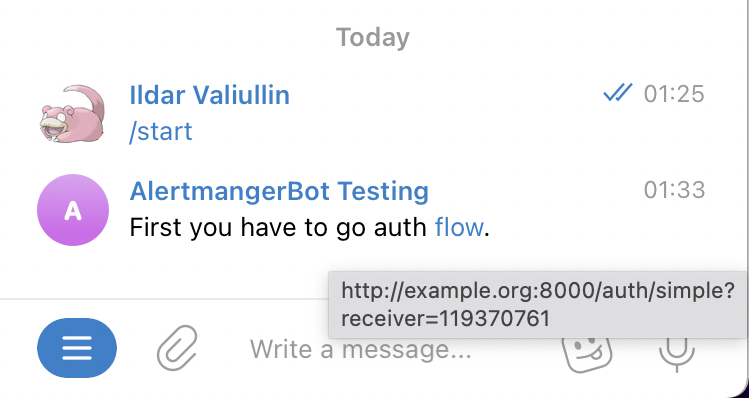
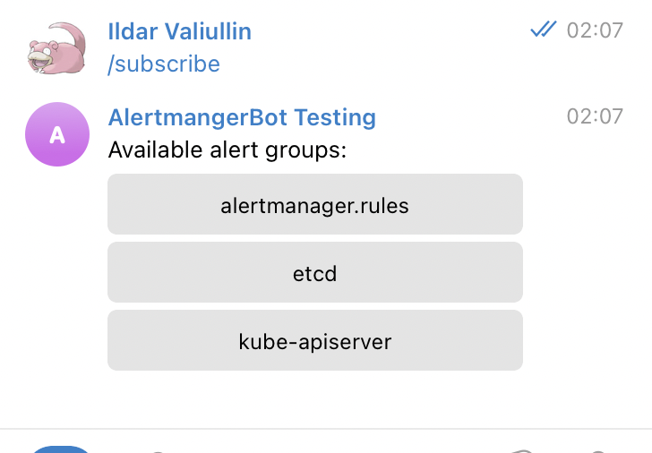
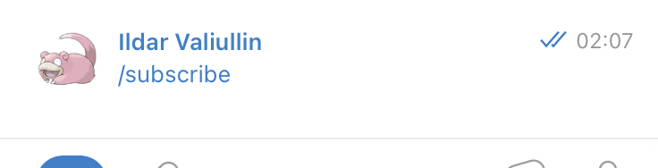
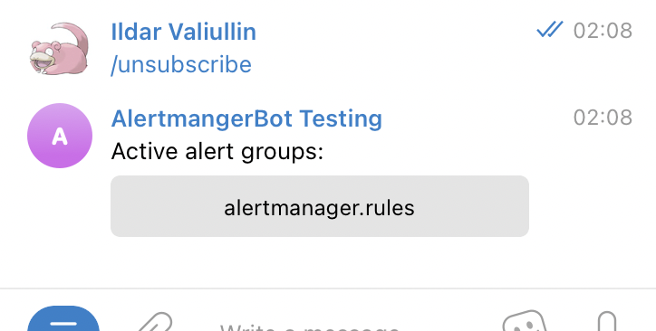
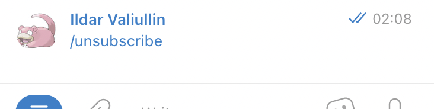

# Pre-install
If you want use this, you should:
* Install and use one of operators: [VictoriaMetrics](https://github.com/VictoriaMetrics/operator) or [Prometheus](https://github.com/prometheus-operator/prometheus-operator) oprator. Right now bot works only with VMRules or PrometheusRules object types.
* Register telegram bot account.

# Installation
You can install it over [helm-chart](../deployments/helm-chart) templates.

# Post-install
After installation complete, you can send commands to bot.

Subscribtion is possible only for "registered" users. It's mean that this chat id must be exists in receivers list. Before registration will be completed, bot will be response to any command with same message:

Following by given link will be add your chat id in receivers list.

## Subscribtion
Subscribtions example:

When you pressed any keyboard key, bot will be remove keyboard:

## Disable subscribtion
Disable subscribtions example:

After button pressing:

